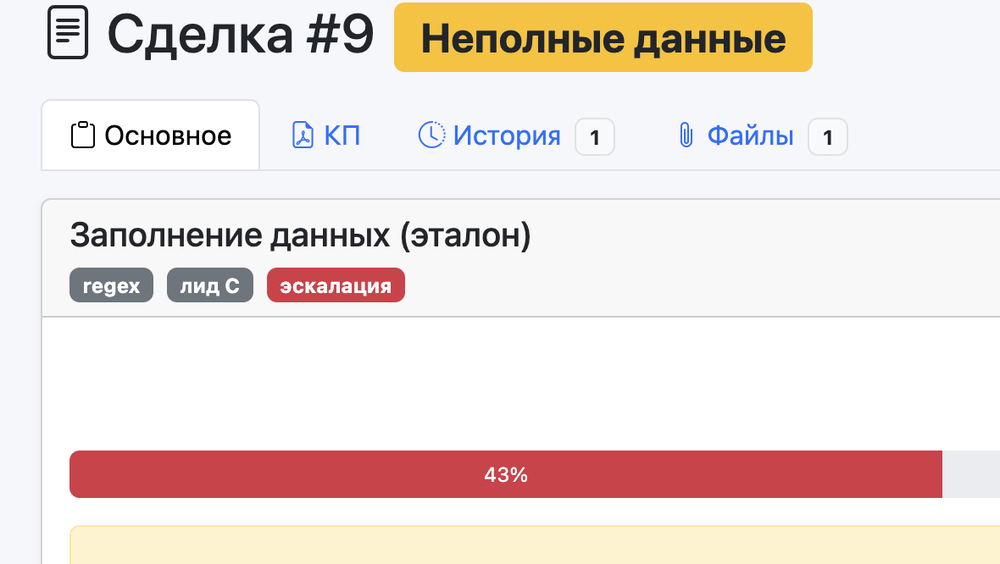

# OfferDesk

**ИЖС-квалификатор лидов** — автоматическая обработка заявок на строительство домов.

Сырой текст с сайта, Авито, Циан или из транскрибации звонка → структурированный JSON → квалификация A/B/C → эскалация риска → сделка в CRM → задача менеджеру. Первый рабочий контур — веб-CRM «Дом-Мастер» (не чат-бот): карточка сделки, эталон, PDF-КП, email.

## Два продукта в одном репо

1. **OfferDesk** — AI-квалификатор лидов для ИЖС (основной продукт).
2. **Personal Assistant** — персональный помощник «от текста до действия»
   (вариант 1 итогового проекта Zerocoder). См. [`docs/README_TASKS.md`](docs/README_TASKS.md).

Прод: [http://194.67.103.144:5001](http://194.67.103.144:5001) · health: `GET /health` · ingest: `POST /ingest` · тег [`v1.1.0`](https://github.com/PavelKarikoff/OfferDesk/releases/tag/v1.1.0)



> **Оффер:** настрою AI-квалификацию заявок для строительной компании под ключ за 5 дней: от Telegram/сайта до CRM с персонализированным ответом. Пилот бесплатно на 50 заявках. Подробности — [`docs/OFFER.md`](docs/OFFER.md).

📚 [`docs/ARCHITECTURE.md`](docs/ARCHITECTURE.md) · 💰 [`docs/ROI.md`](docs/ROI.md) · 🎯 [`docs/OFFER.md`](docs/OFFER.md) · 👥 [`docs/РУКОВОДСТВО_МЕНЕДЖЕРА.md`](docs/РУКОВОДСТВО_МЕНЕДЖЕРА.md) · 🛠️ [`docs/OPS_CRM.md`](docs/OPS_CRM.md) · 📖 [`docs/DOCUMENTATION.md`](docs/DOCUMENTATION.md)

---

## Бизнес-процесс

```text
Заявка (сайт / Авито / Циан / звонок)
        ↓
Разбор  →  LLM (JSON-схема)  или  regex-fallback
        ↓
Квалификация  →  валидация прайса  +  lead scoring A/B/C
        ↓
Распределение  →  эскалация (юр.риск / бюджет ниже порога) или очередь менеджера
        ↓
Ответ клиенту  →  персонализированное письмо (email; WhatsApp — roadmap)
        ↓
Запись в CRM  →  сделка + тег квалификации + задача менеджеру
        ↓
Уведомление менеджера  +  audit_log (вход → JSON → действие → результат)
```

На проде этот контур крутится в OfferDesk CRM. Выгрузка в **amoCRM / Bitrix24** — в roadmap; схема слоёв не привязана к одной CRM.

---

## Где LLM и JSON

Модель поднимает из «сырого» текста заявки структуру. Пример для защиты (смысл полей):

```json
{
  "бюджет": 8500000,
  "площадь_м2": 180,
  "тип_дома": "одноэтажный",
  "участок": "есть, 12 соток, ИЖС",
  "срок_старта": "весна 2026",
  "ипотека": true,
  "регион": "Московская обл.",
  "стиль_общения": "требовательный",
  "скрытые_возражения": ["боится срыва сроков", "сравнивает 3 подрядчика"]
}
```

В коде это Pydantic `DealExtraction` (`extraction/schema.py`):

| Идея | Поле схемы |
|---|---|
| бюджет, ипотека, срок | `deal.budget_rub`, `deal.financing`, `deal.start_date` |
| площадь, участок, тип дома | `object.area_m2`, `object.plot`, `object.floors` / `material` |
| стиль и возражения | `sales_signals.tone`, `sales_signals.objections`, `sentiment` |
| контакты | `client.name` / `phone` / `email` / `telegram` |
| уверенность и пробелы | `confidence`, `missing_fields` |

Промпты: `extraction/prompts/extractor_v1.md`, few-shot `extractor_v2.md`.

---

## Действие на выходе

| Шаг | Сейчас (v1.1.0) | Roadmap |
|---|---|---|
| Сделка в CRM | карточка в OfferDesk, `lead_grade` A/B/C, `extraction_source` | amoCRM / Bitrix24, тег квалификации |
| Эскалация | бейдж + `audit_log` → юрист и/или руководитель ОП | задача в внешней CRM |
| Ответ клиенту | email (SMTP); Telegram — канал КП | WhatsApp; черновик LLM при temperature 0.7 |
| Задача менеджеру | уведомление + напоминание, если сделка стоит > 3 дней | постановка задачи в amo/Bitrix |
| КП | PDF по эталону, если полей ≥ 80% | без изменений контура |

Живые карточки прода: [`prod_deal_card_lead.png`](docs/screenshots/prod_deal_card_lead.png) (сделка A, 71%, regex, лид C) и [`prod_deal_card_escalation.png`](docs/screenshots/prod_deal_card_escalation.png) (сделка B, эскалация `legal_risk`).

---

## Контроль качества

**Валидация** (`extraction/validation/rules.py`):

- бюджет ≥ 3 млн ₽;
- площадь 50–500 м²;
- форматы телефона и email;
- сверка с прайсом: бюджет / площадь ≥ 60 000 ₽/м² (иначе warning).

**Эскалация** (`extraction/validation/escalation.py`):

- бюджет ниже порога или провал валидации → руководитель ОП;
- суд / юрид / угроза в objections **или в сыром тексте** → юрист + руководитель ОП;
- негатив + низкий `etalon_score` → руководитель ОП;
- `source=llm` и `confidence.overall` < 0.6 → менеджер (нужны уточнения);
- `etalon_score` < 30 → менеджер (нужны уточнения).

`low_confidence` **не** эскалирует regex: канал всегда даёт 0.3, иначе эскалировалась бы каждая fallback-сделка. Сознательное отклонение от чеклиста: regex в проде в 71% случаев извлекает корректные поля; мало данных ловится через `etalon_score < 30`. См. [`docs/KNOWN_ISSUES.md`](docs/KNOWN_ISSUES.md) и кадр для защиты [`docs/slides/quality-escalation.pdf`](docs/slides/quality-escalation.pdf).

**Аудит** (`extraction/audit/logger.py` → таблица `audit_log`): вход, `source` (llm / regex / merged), JSON квалификации, `etalon_score`, `lead_grade`, `escalation_json`. Снимок прода: [`prod_audit_log.png`](docs/screenshots/prod_audit_log.png). Дашборд precision/recall в реальном времени — в roadmap; baseline уже есть по golden set.

**Lead scoring A/B/C** по 6 факторам (бюджет, срок, участок, objections, sentiment, decision_maker): A ≥ 0.7, B ≥ 0.4, C < 0.4.

**Отказоустойчивость:** LLM недоступен → regex-fallback; CRM не падает (regex-карточки сняты на проде v1.1.0). LLM-контур работает напрямую, без прокси — проверен живым прогоном golden set 30.09.

---

## Консалтинг

**Контекст.** Отдел продаж ИЖС теряет **30–40% лидов** из-за медленной реакции (норматив — 15 минут, факт — часы).

**Ограничения.** Нет интеграции с 1С; заявки приходят разнородно (сайт, Авито, Циан, звонок). Квалификатор садится **поверх** текущей CRM, процессы не ломает.

**Окупаемость.** Один менеджер ≈ **150 тыс. ₽/мес**. Автоматизация высвобождает **~30% времени** и даёт **+10–15%** конверсии в замер. При среднем чеке **8 млн ₽** и марже **15%** окупаемость — **1–2 месяца**. Полный расчёт: [`docs/ROI.md`](docs/ROI.md).

**Защита «до / после».** Golden set из 15 заявок, precision / recall по полям, пороговый тест от регрессий. LLM-контур (промпт v1, прогон 2026-09-30) против regex-baseline. Телефон сравнивается по цифрам, участок — по соткам:

| Поле | Regex P / R | LLM Precision | LLM Recall | LLM F1 |
|---|---|---|---|---|
| phone | 1.00 / 1.00 | 1.00 | 1.00 | 1.00 |
| email | 1.00 / 1.00 | 1.00 | 1.00 | 1.00 |
| plot | 0.91 / 1.00 | 1.00 | 1.00 | 1.00 |
| material | 1.00 / 1.00 | 1.00 | 1.00 | 1.00 |
| area_m2 | 0.70 / 0.54 | 1.00 | 0.92 | 0.96 |
| financing | 1.00 / 0.50 | 1.00 | 1.00 | 1.00 |
| start_date | 0.60 / 0.30 | 1.00 | 1.00 | 1.00 |
| budget_rub | 0.00 / 0.00 | 1.00 | 1.00 | 1.00 |
| tone | — | 0.87 | 0.87 | 0.87 |
| sentiment | — | 0.80 | 0.80 | 0.80 |

Exact `etalon_score`: regex **8/15 (53.3%)** → LLM **14/15 (93.3%)**. Источники: LLM 12, merged 3 (слияние LLM+regex при confidence < 0.5), regex 0. Regex держит контакты, материал, участок; бюджет, срок, финансирование и площадь — зона LLM: `budget_rub` 0.00 → 1.00. Тон и тональность извлекает только LLM (0.80–0.87 — субъективная разметка). Запуск: `python3 scripts/run_golden_set.py` (LLM) и `--force-regex` (baseline); полный отчёт с TP/FP/FN — `reports/extraction_metrics.md`.

---

## Реализованный контур (CRM «Дом-Мастер»)

Первый заказчик и демо. Telegram — **канал доставки КП**, не интерфейс продукта. Основной канал ответа — **email**.


После заявки или звонка менеджер создаёт сделку, вставляет текст или файл, видит % эталона, грейд лида и эскалацию. Если полей ≥ 80% — генерирует КП, утверждает, отправляет клиенту. Иначе — страница «Недостающие данные» со скриптом вопросов.

### Рабочее место

- вход по логину/паролю, роли менеджер / администратор;
- дашборд: воронка, средний чек, график за 14 дней;
- список сделок: поиск, фильтры, бейджи готовности;
- адаптив: на телефоне список карточками.

### Сделка из заявки / транскрибации

- текст или файл `.txt` / `.docx` / `.pdf`;
- разбор через `extract()` (LLM → JSON → regex-fallback), не через голый `parse_transcript_local`;
- оверрайды менеджера с пересчётом % эталона;
- учебные протоколы в `knowledge_base/` и golden set в `tests/golden_set/`.

### Эталон и КП

Обязательные поля: телефон, email, участок, площадь, материал, сроки, финансирование. Бюджет и Telegram — опциональны. Для клееного бруса нужен проект каталога. Порог: `ETALON_KP_THRESHOLD` (по умолчанию 80).

| % заполнения | Что видит менеджер |
|---|---|
| **≥ 80%** | Можно генерировать КП |
| 50–79% | «Недостающие данные» + вопросы клиенту |
| &lt; 50% | Перезвонить по скрипту |

Два PDF-шаблона: тёплый контур «Дом-Мастер» (площадь × 75 000 ₽/м²) и клееный брус (смета по этапам). Черновик → утверждение → email / Telegram. Цифры в КП ориентировочные; финал — после выезда.

### Инфраструктура

Docker, Waitress + systemd на VPS, health каждые 5 минут, бэкап `deals.db`, OpenAI напрямую (VPN; при недоступности — regex-fallback). Тесты: **119 passed + 15 subtests** (`pytest` из корня). CLI/API генерации АР/ИР: `main.py`, `flask_app.py`, `go_server/`.

---

## Стек

| Слой | Технологии |
|---|---|
| Квалификатор | `extraction/` — Pydantic, `utils.chat_json`, regex-fallback |
| Валидация / эскалация | `extraction/validation/` |
| Lead scoring | `extraction/scoring/lead_score.py` |
| Аудит | `extraction/audit/logger.py` → `audit_log` |
| CRM | Python 3.11+, Flask / Waitress, SQLite, Bootstrap 5 |
| LLM | OpenAI API |
| PDF | Jinja2 → WeasyPrint |
| Отправка | SMTP, Telegram Bot API |
| Контейнеры | Docker, Docker Compose |

Зависимости: [`requirements.txt`](requirements.txt), [`requirements.lock.txt`](requirements.lock.txt).

---

## Быстрый старт

### 1. Клонирование

```bash
git clone https://github.com/PavelKarikoff/OfferDesk.git
cd OfferDesk
```

### 2. Окружение

```bash
python3 -m venv .venv
source .venv/bin/activate   # Windows: .venv\Scripts\activate
pip install -r requirements.txt
```

На macOS для WeasyPrint нужны cairo/pango — см. [`docs/DOCUMENTATION.md`](docs/DOCUMENTATION.md).

### 3. Ключи

```bash
cp .env.example .env
```

| Переменная | Назначение |
|---|---|
| `OPENAI_API_KEY` | ключ OpenAI |
| `OPENAI_MODEL` | по умолчанию `gpt-4o-mini` |
| `SECRET_KEY` | сессии CRM |
| `ETALON_KP_THRESHOLD` | порог эталона для КП (80) |
| `SMTP_*` | письмо клиенту |
| `CRM_PUBLIC_URL` | публичный URL |
| `CRM_ADMIN_USERS` | доп. администраторы |
| `TELEGRAM_BOT_TOKEN` | опционально: КП в Telegram |
| `FLASK_API_TOKEN` | HTTP API генерации и `POST /ingest` |

### 4. Запуск CRM

```bash
cd web_app
PYTHONPATH=.. python3 app.py
# http://127.0.0.1:5001
```

Логин выдаёт администратор. Демо-протоколы: `knowledge_base/demo_protocol_1.md` (≈100%) и `demo_protocol_2.md` (≈43%). Кнопка «Загрузить демо» на боевой CRM **удаляет** сделки (сначала бэкап БД).

```bash
# тесты из корня репозитория
python3 -m pytest -q
```

### 5. CLI и HTTP API (отчёты / КП без CRM)

```bash
python main.py sample_dialog.txt --type ar
python main.py --kp
python main.py --serve          # Flask API
cd go_server && go run ./cmd/server
```

### POST /ingest — приём заявок в контур квалификации

Публичный endpoint для внешних источников (сайт, Авито, Циан):
принимает JSON с текстом заявки, прогоняет через extraction pipeline,
валидирует, эскалирует, считает lead scoring, пишет в `audit_log`.

```bash
curl -X POST http://127.0.0.1:5001/ingest \
     -H "Content-Type: application/json" \
     -H "X-Api-Token: $FLASK_API_TOKEN" \
     -d '{
       "transcript": "Здравствуйте, меня зовут Сергей. Телефон +7 916 123-45-67, почта sergey@example.com. Участок есть, 12 соток в Московской области. Хочу дом из газобетона, 150 квадратов. Бюджет около 9 миллионов, ипотека. Начать хотим в ноябре 2026."
     }'
```

#### Формат ответа

`POST /ingest` возвращает два блока: CRM-проекцию (поля сделки) и
формальный inbox-контракт `action`:

```json
{
  "source": "regex",
  "etalon_score": 71,
  "lead_grade": "C",
  "crm": {...},

  "action": {
    "intent": "qualify",
    "summary": "Лид C. Сергей, 150 м², газобетон",
    "priority": "medium",
    "next_action": "Дозаполнить поля (budget_rub, start_date), затем КП",
    "fields": {...},
    "confidence": "low",
    "escalate": false,
    "meta": {
      "source": "regex",
      "etalon_score": 71,
      "lead_grade": "C",
      "lead_score": 0.3,
      "reasons": []
    }
  }
}
```

Поля `action`:

- `intent` — `quote_request` / `qualify` / `escalate` / `reject`
- `priority` — `low` / `medium` / `high`
- `confidence` — `high` / `medium` / `low` (enum, не число)
- `escalate` — `true` / `false`
- `next_action` — конкретное действие для менеджера

`priority` и `escalate` решает код, а не LLM. Модель не может «замолчать» юридический риск или провал валидации. Старые поля ответа (`source`, `extraction`, `crm`, scoring) сохранены.

При заданном `FLASK_API_TOKEN` требуется заголовок `X-Api-Token`. Если токен в `.env` не задан, заголовок не нужен (только для локальной разработки). Сделка в CRM не создаётся.

### Скрипт-пример `scripts/ingest_example.py`

Автоматический вход без ручного `curl`:

```bash
python3 scripts/ingest_example.py
# Ожидаемо: source: regex, etalon_score: 71, lead_grade: C, escalation: None
```

CRM должна быть запущена (`cd web_app && PYTHONPATH=.. python3 app.py`). URL и токен: `INGEST_URL`, `FLASK_API_TOKEN`.

### 6. Docker

```bash
docker compose up -d --build api
BASE_URL=http://127.0.0.1:5001 ./scripts/check_endpoints.sh --quick
```

---

## Сценарий в демо-CRM

```text
Заявка / звонок
        ↓
  Новая сделка → вставить текст или файл
        ↓
  extract() → llm | regex | merged
        ↓
  валидация + эскалация + lead scoring → audit_log
        ↓
  < 80%  →  «Недостающие данные» + вопросы
  ≥ 80%  →  КП → утвердить → email (или Telegram)
```

Схема слоёв: [`docs/ARCHITECTURE.md`](docs/ARCHITECTURE.md).

---

## Структура проекта

```text
├── extraction/            # квалификатор: LLM, schema, regex, validation, scoring, audit
├── tests/golden_set/      # 15 заявок + эталонные JSON
├── web_app/               # демо-CRM: сделки, эталон, КП, дашборд
├── knowledge_base/        # эталон протокола, прайс, демо-протоколы
├── utils/                 # КП / АР / ИР / PDF, chat_json
├── templates/             # Jinja2 PDF
├── scripts/               # golden set, деплой, health, ingest_example
├── docs/
│   ├── ARCHITECTURE.md
│   ├── ROI.md
│   ├── OFFER.md
│   └── screenshots/       # в т.ч. prod_* для v1.1.0
├── main.py / flask_app.py / go_server/
└── bot.py                 # не продукт: привязка чата и доставка КП
```

---

## Возможное развитие

1. Выгрузка в amoCRM / Bitrix24 с тегом квалификации и задачей менеджеру.
2. WhatsApp и автоответ с сайта / Авито.
3. Актуальные прайсы из 1С.
4. Дашборд точности извлечения (precision/recall в реальном времени).
5. Черновик ответа клиенту отдельным вызовом LLM с `temperature=0.7`. Сейчас `utils.chat_json` фиксирован на `0.2` — это безопаснее для извлечения; креативный шаг потребует `chat_json(..., temperature=...)`. Фиктивный второй шаг при 0.2 на защиту не выносим.

---

## Лицензия

[MIT](LICENSE).

## Автор

[PavelKarikoff](https://github.com/PavelKarikoff) — квалификатор заявок ИЖС и рабочий контур CRM/КП для отдела продаж.
