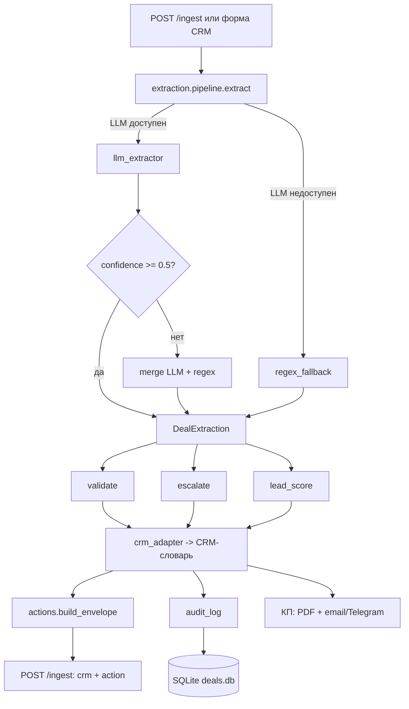

# Архитектура OfferDesk

## Схема процесса



## Слои extraction/

| Слой | Модуль | Ответственность |
|---|---|---|
| Схема | `schema.py` | Pydantic `DealExtraction`, `etalon_score()`, `required_filled()` |
| LLM | `llm_extractor.py` | Вызов `utils.chat_json`, structured output, промпт v1/v2 |
| Fallback | `regex_fallback.py` | Обёртка над `transcript_parser_local`, маппинг в `DealExtraction` |
| Actions | `actions.py` | Формальный inbox-контракт (`intent`/`priority`/`next_action`) поверх DealExtraction |

## Логика pipeline

`extract(transcript, force_regex=False)`:

1. `force_regex=True` → regex
2. LLM (`utils.chat_json`). При ошибке → regex, `meta.llm_error` заполнен
3. `confidence.overall < 0.5` → merge LLM + regex
4. иначе → LLM

Результат: `(DealExtraction, source ∈ {llm, regex, merged}, meta)`
`meta = {llm_error, llm_attempted}`. Если LLM упал, regex — страховка, но `escalate()` ставит `llm_failed`.

## Контур отказа

LLM недоступен → `APIConnectionError` → regex fallback → процесс не останавливается.

Golden set 15 кейсов, живые прогоны (2026-09-30, промпт v1; телефон сравнивается по цифрам):

- LLM-контур: exact `etalon_score` 14/15 (93.3%); источники: LLM 12, merged 3, regex 0;
- слабые поля regex (baseline): `budget_rub` recall 0.00, `start_date` recall 0.30, `financing` recall 0.50;
- зона LLM: `budget_rub`, `start_date`, `financing`, `area_m2`, `tone`, `sentiment` — 0.96–1.00 против 0.40–0.61 у regex;
- сильные поля regex: `phone`, `email`, `material` — precision/recall 1.00;
- снимки прогонов: `reports/metrics_llm_v1.txt`, `reports/metrics_regex.txt`.

## Валидация и эскалация

| Правило | Триггер | Действие |
|---|---|---|
| `budget_below_min` | `budget_rub` < 3 млн | `validation_failed` → эскалация |
| `area_out_of_range` | `area_m2` ∉ [50, 500] | `validation_failed` → эскалация |
| `phone_format` / `email_format` | regex не совпал | `validation_failed` → эскалация |
| `below_company_price` | budget/area < 60k | warning (не эскалация) |
| `low_confidence` | `source=llm` и `confidence.overall` < 0.6 | эскалация → менеджер (нужны уточнения) |
| `insufficient_data` | `etalon_score` < 30 | эскалация → менеджер (нужны уточнения) |
| `legal_risk` | «суд», «юрид», «проверк», «травм», «угроз» в objections или в сыром тексте | эскалация → юрист + руководитель ОП |
| `negative_and_low_score` | sentiment=негативный и `etalon_score` < 30 | всегда вместе с `insufficient_data` → менеджер, если нет `legal_risk` |
| `llm_failed` | LLM упал (сеть / невалидный JSON / схема), regex-fallback | эскалация → менеджер (нужны уточнения) |
| `validation_failed` | `validation.ok=False` | эскалация → руководитель ОП |

`low_confidence` срабатывает только для `source=llm`. Regex всегда даёт `0.3` —
метка канала, не оценка качества: иначе каждая fallback-сделка уходила бы к
человеку. Это **сознательное отклонение** от чеклиста (`confidence=low → escalate`).
В проде regex в 71% случаев извлекает корректные поля. Нехватка данных ловится
отдельно: `etalon < 30` → `insufficient_data` (мягкая эскалация). Подробнее —
`docs/KNOWN_ISSUES.md`.

## Lead scoring

| Фактор | Вес | Условие |
|---|---|---|
| `budget` | 0.25 | `budget_rub` ≥ 3 млн |
| `start_date` | 0.15 | заполнен срок старта |
| `plot` | 0.15 | заполнен участок |
| `no_objections` | 0.15 | нет objections и `etalon_score` > 0 |
| `positive_sentiment` | 0.15 | sentiment = позитивный |
| `decision_maker` | 0.15 | `decision_maker` = true |

Grade: A ≥ 0.7, B ≥ 0.4, C < 0.4.

## Формальный inbox-контракт

`POST /ingest` отдаёт два блока: CRM-проекцию (`crm`, `extraction`, scoring) и `action` из `extraction/actions.py`. Envelope считается **кодом** поверх `DealExtraction` + `validate()` + `escalate()` + `score()`. Модель не решает `priority` и `escalate`.

| Поле | Тип | Значения |
|---|---|---|
| `intent` | enum | `quote_request` / `qualify` / `escalate` / `reject` |
| `summary` | str | короткая сводка только из заполненных полей, без выдумок |
| `priority` | enum | `low` / `medium` / `high` |
| `next_action` | str | конкретное действие для менеджера |
| `fields` | object | CRM-проекция извлечённых данных |
| `confidence` | enum | `high` / `medium` / `low` (не число; regex всегда `low`) |
| `escalate` | bool | `true` / `false` |
| `meta` | object | `source`, `etalon_score`, `lead_grade`, `lead_score`, `reasons` |

| `intent` | Когда |
|---|---|
| `quote_request` | эталон ≥ 80%, нет жёсткой эскалации |
| `qualify` | эталон < 80% без жёстких причин; `insufficient_data` — мягкая эскалация (`escalate=true`, intent=qualify) |
| `escalate` | юр. риск, низкая уверенность LLM, падение LLM, провал валидации (кроме «только бюджет») |
| `reject` | единственная жёсткая проблема — бюджет < 3 млн |

| `priority` | Когда |
|---|---|
| `high` | есть эскалация **или** лид A |
| `medium` | лид B, без эскалации |
| `low` | лид C, без эскалации |

| `confidence` | Когда |
|---|---|
| `low` | `source=regex` **или** `overall` < 0.5 |
| `medium` | LLM/merged и `0.5 ≤ overall < 0.75` |
| `high` | LLM/merged и `overall ≥ 0.75` |

## Аудит

Таблица `audit_log` в `deals.db`:

- `deal_id`, `ts`, `source`, `status` (`success` / `escalated` / `error`);
- `input_text`, `result_json`, `error_detail`;
- `etalon_score`, `confidence`;
- `validation_json`, `escalation_json`;
- `lead_grade`, `lead_score`.

Используется для:

- контроля качества (сколько `llm` / `regex` / `merged`);
- разбора инцидентов (кто и как разобрал сделку);
- дашборда (средний `confidence`, % эскалаций, распределение A/B/C).

## Известные ограничения

См. `docs/KNOWN_ISSUES.md`:

- LLM-канал требует доступ к OpenAI (VPN; прокси выпилен из `.env`), при недоступности — regex-fallback;
- `transcript_parser_local` теряет дробную часть бюджета («6.5 млн» → «5 млн»);
- методика метрик исправлена (TP только при `exp == got`);
- `low_confidence` эскалирует только LLM (`source=llm`), не regex — сознательное отклонение, см. KNOWN_ISSUES;
- черновик ответа клиенту при `temperature=0.7` не вынесен: `utils.chat_json` фиксирован на `0.2`. Фиктивный второй шаг не делаем — см. roadmap ниже.

## Roadmap

- Вынести черновик ответа клиенту (`extraction/draft_reply.py`) в отдельный вызов LLM с `temperature=0.7`. Для этого нужен `chat_json(..., temperature=...)`; сейчас `0.2` — правильная температура для извлечения, не для текста.

## Тесты

- `tests/test_extraction.py` — 25 тестов (схема, хелперы, regex, pipeline).
- `tests/test_validation.py` — 16 тестов (rules + escalation).
- `tests/test_scoring.py` — 5 тестов (A/B/C, факторы).
- `tests/test_actions.py` — inbox-контракт (intent / priority / confidence / escalate).
- `tests/test_extraction_quality.py` — пороговый тест по golden set.
- `web_app/tests/` — 55 существующих тестов.

Запуск:

```bash
python3 -m pytest -q   # 119 passed + 15 subtests, из корня
python3 -m unittest tests.test_extraction tests.test_validation \
                  tests.test_scoring tests.test_actions \
                  tests.test_extraction_quality -v
cd web_app && PYTHONPATH=.. python3 -m unittest discover -s tests -v
```

