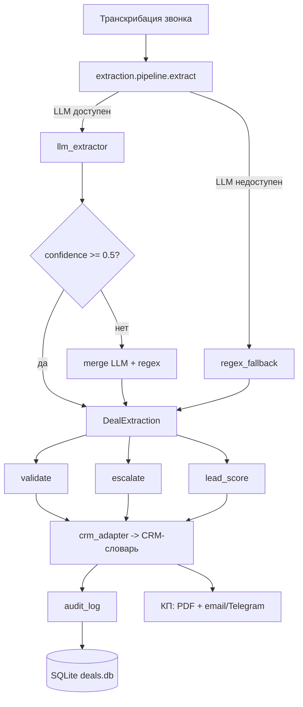

# Архитектура OfferDesk

## Схема процесса



## Слои extraction/

| Слой | Модуль | Ответственность |
|---|---|---|
| Схема | `schema.py` | Pydantic `DealExtraction`, `etalon_score()`, `required_filled()` |
| LLM | `llm_extractor.py` | Вызов `utils.chat_json`, structured output, промпт v1/v2 |
| Fallback | `regex_fallback.py` | Обёртка над `transcript_parser_local`, маппинг в `DealExtraction` |

## Логика pipeline

`extract(transcript, force_regex=False)`:

1. `force_regex=True` → regex
2. LLM (`utils.chat_json`). При ошибке → regex
3. `confidence.overall < 0.5` → merge LLM + regex
4. иначе → LLM

Результат: `(DealExtraction, source ∈ {llm, regex, merged})`

## Контур отказа

LLM недоступен → `APIConnectionError` → regex fallback → процесс не останавливается.

Проверено вживую (прокси OpenAI недоступен на момент сдачи):

- baseline regex: exact `etalon_score` 8/15 (53.3%);
- слабые поля regex: `budget_rub` recall 0.00, `start_date` recall 0.30, `financing` recall 0.50;
- сильные поля regex: `phone`, `email`, `material` — precision/recall 1.00.

## Валидация и эскалация

| Правило | Триггер | Действие |
|---|---|---|
| `budget_below_min` | `budget_rub` < 3 млн | `validation_failed` → эскалация |
| `area_out_of_range` | `area_m2` ∉ [50, 500] | `validation_failed` → эскалация |
| `phone_format` / `email_format` | regex не совпал | `validation_failed` → эскалация |
| `below_company_price` | budget/area < 60k | warning (не эскалация) |
| `legal_risk` | «суд», «юрид», «проверк», «травм», «угроз» в objections или в сыром тексте | эскалация → юрист + руководитель ОП |
| `negative_and_low_score` | sentiment=негативный и `etalon_score` < 30 | эскалация → руководитель ОП |
| `validation_failed` | `validation.ok=False` | эскалация → руководитель ОП |

`low_confidence` не триггерит эскалацию: regex всегда даёт `confidence=0.3`, это шум. Метрика пишется в `audit_log`, триггером не является.

## Lead scoring

| Фактор | Вес | Условие |
|---|---|---|
| `budget` | 0.25 | `budget_rub` ≥ 3 млн |
| `start_date` | 0.15 | заполнен срок старта |
| `plot` | 0.15 | заполнен участок |
| `no_objections` | 0.15 | нет objections и `etalon_score` > 0 |
| `positive_sentiment` | 0.15 | sentiment = позитивный |
| `decision_maker` | 0.15 | `decision_maker` = true |

Grade: A ≥ 0.7, B ≥ 0.4, C < 0.4.

## Аудит

Таблица `audit_log` в `deals.db`:

- `deal_id`, `ts`, `source`, `etalon_score`, `confidence`;
- `validation_json`, `escalation_json`;
- `lead_grade`, `lead_score`.

Используется для:

- контроля качества (сколько `llm` / `regex` / `merged`);
- разбора инцидентов (кто и как разобрал сделку);
- дашборда (средний `confidence`, % эскалаций, распределение A/B/C).

## Известные ограничения

См. `docs/KNOWN_ISSUES.md`:

- прокси OpenAI недоступен на момент сдачи → LLM-метрики в roadmap;
- `transcript_parser_local` теряет дробную часть бюджета («6.5 млн» → «5 млн»);
- методика метрик исправлена (TP только при `exp == got`);
- `low_confidence` убран из триггеров эскалации.

## Тесты

- `tests/test_extraction.py` — 25 тестов (схема, хелперы, regex, pipeline).
- `tests/test_validation.py` — 11 тестов (rules + escalation).
- `tests/test_scoring.py` — 5 тестов (A/B/C, факторы).
- `tests/test_extraction_quality.py` — пороговый тест по golden set.
- `web_app/tests/` — 45 существующих тестов.

Запуск:

```bash
python3 -m unittest tests.test_extraction tests.test_validation \
                  tests.test_scoring tests.test_extraction_quality -v
cd web_app && PYTHONPATH=.. python3 -m unittest discover -s tests -v
```

