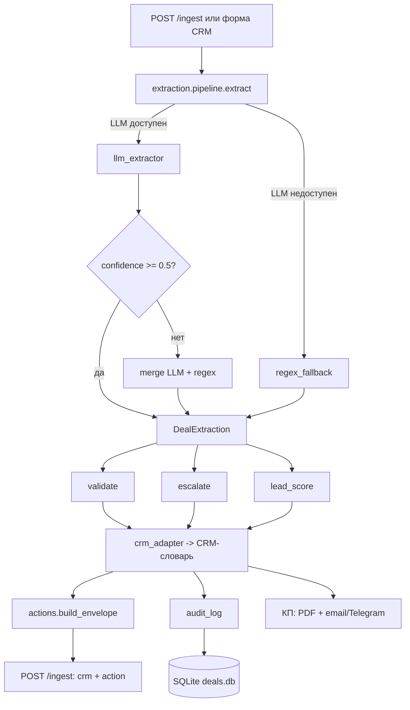

> ⚠️ **Архив. Версия 02.10.2026 (v1.1.0).**
> Актуальный отчёт — [`docs/Отчет_выпускной_финал_2026_10_08.md`](Отчет_выпускной_финал_2026_10_08.md).
> Этот файл сохранён как история проекта.

---

# Выпускной отчёт: OfferDesk — AI-квалификация входящих заявок ИЖС

**Курс:** «Профессия вайб-кодер» · **Защита:** 02.10.2026  
**Автор:** Павел Кариков · **Репо:** https://github.com/PavelKarikoff/OfferDesk  
**Сценарий:** **B — процесс продаж (лиды)**
**Продукт:** OfferDesk v1.1.0 (тег `v1.1.0`) · прод: http://194.67.103.144:5001
**Стек:** Python 3.11 · Flask · SQLite · OpenAI gpt-4o-mini · SMTP + Telegram

---

## 1. Выбранный сценарий и почему

### 1.1. Формулировка варианта B из задания

> **Вариант B — Процесс продаж (лиды).** Вход: лид / заявка (текст / форма).
> Выход: оценка лида (категория / оценка) + следующий шаг + запись в журнал.

### 1.2. Почему B

1. **Реальная боль знакомого бизнеса.** Отдел продаж строительной компании «Дом-Мастер»
   (дома ИЖС): теряется 30–40% лидов из-за медленной реакции — норма 15 минут,
   факт — часы. Не учебная задача «про лиды», а измеримый процесс.
2. **Есть данные для калибровки.** Доступ к реальным протоколам звонков позволил собрать
   golden set из 15 эталонных кейсов и измерять качество извлечения не «на глаз»,
   а метриками (exact-совпадение, precision/recall по полям).
3. **Эффект считается в деньгах.** Средний чек 8 млн ₽, маржа 15% (= 1,2 млн ₽ со сделки) —
   каждый процент конверсии и каждый час менеджера переводится в ₽ (раздел 8).
4. **Частично покрывает и сценарий C.** Черновик документа из варианта C вошёл в OfferDesk
   как автоматическая сборка КП (PDF) из извлечённых полей.

**Почему не A (поддержка):** нет реального потока обращений, на котором можно собрать
золотой набор и показать метрики; категоризация обращений не даёт прямой денежной метрики.
**Почему не C в чистом виде:** извлечение полей из ТЗ без цикла продаж труднее связать
с деньгами; кейс B даёт замкнутый контур «заявка → квалификация → КП → сделка».

### 1.3. Соответствие контракту варианта B

| Требование B | Реализация в OfferDesk |
|---|---|
| Вход: лид / заявка (текст / форма) | `POST /ingest` — сырой текст заявки (Яндекс Директ, таргет, Авито, сайт, Циан, протокол звонка); форма сделки в CRM (текст или файл) |
| Оценка лида (категория / оценка) | `lead_grade` A/B/C + `lead_score` (6 факторов, веса 0.15–0.25) |
| Следующий шаг | `next_action` (КП / дозаполнить / перезвонить) + эскалация по 5 правилам |
| Запись в журнал | `audit_log` в SQLite: вход → JSON → действие → результат |

«Следующий шаг» в OfferDesk — это не только текстовая рекомендация `next_action`, но и
само действие системы: при эталоне ≥ 80% OfferDesk автоматически собирает КП (PDF из
извлечённых полей), а после утверждения менеджером отправляет его клиенту (Email —
основной канал, Telegram — после привязки чата). При нехватке данных следующий шаг —
дозаполнение по готовому скрипту вопросов (50–79%) или перезвон по скрипту (< 50%).
Полный контур КП — раздел 7.

### 1.4. Исходная идея и её сужение до ограничений курса

Проект начался с более широкой идеи: заявка → разбор → квалификация → **выгрузка в
amoCRM/Bitrix24 с тегом** → ответ клиенту в **WhatsApp** → задача менеджеру → дашборд
точности. Ограничения курса (ровно 2 интеграции, один процесс, одно действие на выходе —
запись в журнал) потребовали сознательного сужения:

| Идея | Реализация v1.1.0 | Roadmap |
|---|---|---|
| amoCRM / Bitrix24 + тег квалификации | собственная CRM-карточка в OfferDesk (SQLite), `lead_grade` A/B/C | выгрузка в amo/Bitrix24 |
| Ответ клиенту в WhatsApp | Email (SMTP) — основной; Telegram — опциональный канал КП | WhatsApp, черновик LLM (temperature 0.7) |
| Постановка задачи менеджеру | бейдж эскалации + напоминание, если сделка стоит > 3 дней | задачи во внешней CRM |
| Дашборд точности | baseline по golden set + журнал `audit_log` | live-дашборд precision/recall |

Интеграции в проде — ровно две: **SMTP** (отправка КП) и **Telegram** (канал КП после
привязки клиента + служебный бот для менеджеров). OpenAI — ядро стека, а не интеграция.

---

## 2. Проблема, контекст, ограничения

### 2.1. Бизнес-контекст

Компания «Дом-Мастер» — строительство домов ИЖС (газобетон, клееный брус). Отдел
продаж — 5 менеджеров. Средний чек — 8 млн ₽ (тёплый контур 75 000 ₽/м² × ~107 м²),
маржа 15% = 1,2 млн ₽ с одной сделки.

### 2.2. Проблема (baseline, до автоматизации)

- **30–40% лидов теряются** — реакция на заявку занимает часы вместо нормативных 15 минут;
- **40–60 минут** уходит на подготовку одного КП вручную;
- заявки приходят **разнородные** (Яндекс Директ, таргетированная реклама, Авито, сайт, Циан, протоколы звонков) — «сырой» текст,
  из которого поля приходится вытаскивать руками;
- **нет контроля качества данных**: непонятно, какие поля заполнены достоверно, а какие — заглушки.

### 2.3. Ограничения задачи (требования курса и как они выполнены)

| Требование | Выполнение |
|---|---|
| Python ≥ 3.10 | Python 3.11 (закреплён в Dockerfile) |
| Точка входа для AI-контура | Flask `POST /ingest` |
| Хранилище | SQLite: `deals` + `audit_log` |
| LLM-ядро | OpenAI gpt-4o-mini (~5K токенов/сделка) |
| Периодический запуск | systemd-таймер раз в 5 минут (эквивалент cron — оговорено) |
| Количество интеграций | ровно 2: SMTP + опциональный Telegram |
| «Не идеальный продукт» | честный `docs/KNOWN_ISSUES.md` с обоснованием каждого пункта |
| Развёртывание | Docker + Waitress на VPS, прод http://194.67.103.144:5001 |

Ограничения бизнес-контекста, которые нельзя было «решить кодом»: нет интеграции с 1С
(прайс зашит как ставка 75 000 ₽/м²), **юридическая ответственность за КП остаётся на
менеджере** — поэтому контур «черновик → утверждение человеком», LLM не решает цену.

---

## 3. Архитектура процесса

### 3.1. Схема



### 3.2. Слои `extraction/`

| Слой | Модуль | Ответственность |
|---|---|---|
| Схема | `schema.py` | Pydantic `DealExtraction`, `etalon_score()`, `required_filled()` |
| LLM | `llm_extractor.py` | вызов `utils.chat_json`, structured output, промпт v1/v2 |
| Fallback | `regex_fallback.py` | разбор без LLM, маппинг в `DealExtraction` |
| Actions | `actions.py` | формальный inbox-контракт поверх извлечения |

### 3.3. Логика pipeline

`extract(transcript)`:

1. LLM-извлечение (`utils.chat_json`, structured output). При ошибке → regex-fallback,
   `meta.llm_error` заполнен;
2. `confidence.overall < 0.5` → **merge** LLM + regex (пустые поля добирает regex);
3. иначе — чистый LLM;
4. результат: `DealExtraction` + `source ∈ {llm, regex, merged}` + meta.

Далее **код** (не LLM) выполняет `validate()` → `escalate()` → `lead_score()` →
сборку envelope → запись в `audit_log` и сборку КП.

**Контур отказа:** LLM недоступен → `APIConnectionError` → regex-fallback → процесс
не останавливается, CRM не падает. Снято на проде v1.1.0 (regex-карточки).

---

## 4. Формат структурированного JSON

### 4.1. Принцип: LLM извлекает — код решает

Модель поднимает из «сырого» текста структуру (Pydantic `DealExtraction`). Идея → поле схемы:

| Идея (из проекта) | Поле схемы |
|---|---|
| бюджет, ипотека, срок старта | `deal.budget_rub`, `deal.financing`, `deal.start_date` |
| площадь, участок, тип дома | `object.area_m2`, `object.plot`, `object.floors` / `material` |
| стиль общения, скрытые возражения | `sales_signals.tone`, `sales_signals.objections`, `sentiment` |
| контакты | `client.name` / `phone` / `email` / `telegram` |
| уверенность и пробелы | `confidence`, `missing_fields` |

### 4.2. Inbox-контракт (реальный пример из прода)

`POST /ingest` возвращает CRM-проекцию и формальный контракт `action`:

```json
{
  "source": "regex",
  "etalon_score": 71,
  "lead_grade": "C",
  "crm": { "...": "..." },

  "action": {
    "intent": "qualify",
    "summary": "Лид C. Сергей, 150 м², газобетон",
    "priority": "medium",
    "next_action": "Дозаполнить поля (budget_rub, start_date), затем КП",
    "fields": { "...": "..." },
    "confidence": "low",
    "escalate": false,
    "meta": {
      "source": "regex",
      "etalon_score": 71,
      "lead_grade": "C",
      "lead_score": 0.3,
      "reasons": []
    }
  }
}
```

### 4.3. Расшифровка полей action

| Поле | Значения | Кто решает |
|---|---|---|
| `intent` | `quote_request` / `qualify` / `escalate` / `reject` | код по правилам |
| `priority` | `low` / `medium` / `high` (high = эскалация ИЛИ лид A) | **код, не LLM** |
| `confidence` | enum `high` / `medium` / `low` (не число) | код по source и overall |
| `escalate` | bool | **код, не LLM** |
| `next_action` | текст конкретного действия для менеджера | код |

Envelope — это **код поверх** `DealExtraction` + `validate()` + `escalate()` + `score()`.
Модель не может «замолчать» юридический риск или провал валидации — они попадают в
`action` независимо от того, что «думает» LLM.

---

## 5. Контроль качества

### 5.1. Валидация (`extraction/validation/rules.py`)

| Правило | Проверка | Последствие |
|---|---|---|
| `budget_below_min` | `budget_rub` < 3 млн ₽ | `validation_failed` → эскалация |
| `area_out_of_range` | `area_m2` ∉ [50, 500] | `validation_failed` → эскалация |
| `phone_format` | `^7\d{10}$` после нормализации по цифрам | `validation_failed` → эскалация |
| `email_format` | regex | `validation_failed` → эскалация |
| `below_company_price` | бюджет/м² < 60 000 ₽ | warning (не эскалация) |

### 5.2. Эскалация (`extraction/validation/escalation.py`)

| Триггер | Кому |
|---|---|
| `legal_risk` («суд», «юрид», «проверк», «травм», «угроз» в objections **или в сыром тексте**) | юрист + руководитель ОП |
| `validation_failed`, `budget_below_min` | руководитель ОП |
| `low_confidence` (`source=llm`, `confidence.overall` < 0.6) | менеджер (уточнить) |
| `insufficient_data` (`etalon_score` < 30) | менеджер (уточнить) |
| `llm_failed` (LLM упал, работает regex) | менеджер (сверить поля) |

**Сознательное отклонение от чеклиста:** `low_confidence` **не** эскалирует regex.
Regex всегда даёт `confidence 0.3` — это метка канала, а не оценка качества; иначе каждая
fallback-сделка уходила бы к человеку. По golden set regex в 71% случаев извлекает
поля корректно, а нехватка данных ловится отдельным правилом `etalon < 30`.
Обоснование зафиксировано в `docs/KNOWN_ISSUES.md`.

### 5.3. Метрики качества (golden set, живой прогон 30.09.2026, промпт v1)

| Метрика | LLM-контур | regex-baseline |
|---|---|---|
| Exact-совпадение (etalon) | **14/15 = 93.3%** | 8/15 = 53.3% |
| Источники решений | LLM 12 · merged 3 · regex 0 | — |

- **зона LLM** (`budget_rub`, `start_date`, `financing`, `area_m2`, `tone`, `sentiment`):
  0.96–1.00 против 0.40–0.61 у regex;
- слабые поля regex: `budget_rub` recall **0.00**, `start_date` **0.30**, `financing` **0.50**;
- сильные поля regex: `phone`, `email`, `material` — precision/recall 1.00;
- субъективная разметка: `tone` 0.87, `sentiment` 0.80;
- снимки прогонов: `reports/metrics_llm_v1.txt`, `reports/metrics_regex.txt`.

**Пороги действий:** `etalon_score` ≥ 80% → можно КП; 50–79% → «Недостающие данные»
(готовый скрипт вопросов); < 50% → перезвонить. `MIN_CONFIDENCE = 0.6` для LLM-канала.

**Промпты:** v1 в проде (измерен живым прогоном); v2 с few-shot готов к сравнению
(снимок 29.09: 15/15 exact, tone 0.93) — в roadmap A/B.

**Тесты:** `python3 -m pytest -q` — **119 passed + 15 subtests** (extraction, validation,
scoring, actions, пороговый тест по golden set, 55 тестов веб-CRM).

---

## 6. Журнал обработки (аудит)

### 6.1. Что и где хранится

Таблица `audit_log` в SQLite (`deals.db`, VPS прода). По одной записи на каждую обработку:

| Поле | Смысл |
|---|---|
| `deal_id`, `ts` | связь со сделкой и время |
| `source` | `llm` / `regex` / `merged` — кто разобрал заявку |
| `status` | `success` / `escalated` / `error` |
| `input_text` | сырой вход |
| `result_json` | полный JSON квалификации |
| `error_detail` | детали сбоя |
| `etalon_score`, `confidence` | качество извлечения |
| `validation_json`, `escalation_json` | что нашла валидация и куда эскалировано |
| `lead_grade`, `lead_score` | категория и оценка лида |

### 6.2. Поведение авто-контура

`POST /ingest` пишет запись в `audit_log` с `deal_id=None` и **не создаёт** сделку в CRM —
сознательно: в авто-контуре нет менеджера и его правок (overrides). Сделку создаёт менеджер
в веб-CRM — тогда у записи появляется `deal_id` и полная история.

### 6.3. Зачем журнала три сценария использования

1. **контроль качества** — доля `llm` / `regex` / `merged`, средний `confidence`;
2. **разбор инцидентов** — кто, что и как разобрал; восстановимо по `input_text` + `result_json`;
3. **дашборд** — % эскалаций, распределение лидов A/B/C, динамика точности
   (live-дашборд — roadmap; baseline зафиксирован по golden set).

---

## 7. Действие на выходе — что получает бизнес

### 7.1. Цикл обработки заявки: до и после

| Шаг | Вручную | С OfferDesk |
|---|---|---|
| Разбор заявки в структуру | 15–20 мин вручную | секунды (LLM + regex) |
| Проверка полей, скрипт дозаполнения | «на глаз» | подсказки: % эталона, грейд, эскалация |
| Сборка КП (PDF) | 40–60 мин | секунды, менеджер только проверяет |
| **итог на заявку** | **~50 мин** | **~6 мин** (проверка + утверждение) |

### 7.2. Что видит менеджер после вставки протокола

- **% заполнения эталона** (7 обязательных полей: телефон, email, участок, площадь,
  материал, сроки, финансирование; для бруса + проект каталога) — разрешает КП;
- **грейд лида A/B/C** — порядок очереди (бюджет, срок, участок, возражения, тон, ЛПР);
- **бейдж эскалации** — «нужен человек»: причина и адресат (→ юрист+РОП / → РОП / → менеджер).

Три исхода: **≥ 80%** → генерация КП (газобетон: площадь × 75 000 ₽/м²; брус: смета по
этапам + 5% накладных, без проекта каталога КП не собирается); **50–79%** → «Недостающие
данные» с готовыми вопросами клиенту; **< 50%** → перезвонить по скрипту.

### 7.3. Доставка и контроль

- КП проходит контур **черновик → утверждение** («УТВЕРЖДЕНО», водяной знак) —
  LLM не решает цену, юридическая ответственность на менеджере;
- каналы: **Email (SMTP)** — основной, **Telegram** — после привязки клиента;
- напоминание, если сделка стоит без действий > 3 дней;
- статусы сделки: Новая → Неполные данные → КП готово → КП отправлено → Завершена/Проиграна.

Скриншоты прода: `docs/screenshots/prod_deal_card_lead.png`,
`prod_deal_card_escalation.png`, `prod_audit_log.png`.

**Итог для бизнеса:** лид не теряется (реакция минуты, не часы), КП уходит за ~6 минут
вместо ~50, слабые и рискованные заявки автоматически попадают к нужной роли
(юрист / руководитель / менеджер), а все решения восстанавливаются из журнала.

---

## 8. Мини-экономика

### 8.1. Экономия времени (прямая)

5 менеджеров × 20 КП/мес × 50 мин = **~83 ч/мес** уходит на ручную подготовку КП.
С OfferDesk на те же 100 обработок остаётся **~10 ч** (проверка + утверждение) —
высвобождается **~73 ч/мес**, или **~36 500 ₽/мес** при ставке 500 ₽/час.

### 8.2. Стоимость 100 обработок: до и после

| | Вручную | С OfferDesk |
|---|---|---|
| Время | ~83 ч менеджеров | ~10 ч (проверка + утверждение) |
| Деньги | ~41 500 ₽ (83 ч × 500 ₽) | **~7 200–8 700 ₽**: 5 000 ₽ проверка менеджером + 1 500–3 000 ₽ OpenAI (~15–30 ₽/заявка) + 700 ₽ VPS/мес |
| **Экономия** | | **~33 000 ₽ на 100 обработках ≈ 5×** |

### 8.3. Главный рычаг — конверсия

Скорость реакции (минуты вместо часов) даёт **+10–15% конверсии** в замер:
+10–15 замеров из 100 лидов → **+1–2 сделки/мес × 1,2 млн ₽ маржи = +1,2–2,4 млн ₽/мес**.

### 8.4. Формула для понимания масштаба

API-бюджет 100 обработок (~3 000 ₽) = **0,25% маржи одного построенного дома**.

### 8.5. Окупаемость

| Сценарий | Экономия/мес | Затраты/мес | Окупаемость |
|---|---|---|---|
| Пессимистичный (только время) | 36 500 ₽ | 30 000 ₽ | ~1 месяц |
| Базовый (+1 сделка) | 1,24 млн ₽ | 40 000 ₽ | ~1 неделя |
| Оптимистичный (+2 сделки) | 2,44 млн ₽ | 50 000 ₽ | ~3 дня |

В расчёт не входят: интеграция с 1С/Битрикс24 (roadmap), юр. экспертиза КП (остаётся за
компанией), изменение бизнес-процессов. Расчёт: `docs/ROI.md`.

---

## 9. План v.2

План v.2 консолидирует направления развития из презентации (слайд «Что дальше»)
и дополняет их новым пунктом — сквозной аналитикой платных каналов до CPQL.

### 9.1. Направления развития

| # | Направление | Что даёт бизнесу |
|---|---|---|
| 1 | Промпт v2 (few-shot): перепрогон golden set, A/B с v1 | tone 0.87 → 0.93 (снимок 29.09: 15/15 exact) |
| 2 | Выгрузка в amoCRM / Bitrix24 | сделка с тегом квалификации + задача менеджеру во внешней CRM |
| 3 | Интеграция с 1С | актуальные прайс-листы (сейчас ставка 75 000 ₽/м² зашита) |
| 4 | Live-дашборд качества | precision/recall, % эскалаций, распределение A/B/C поверх `audit_log` |
| 5 | WhatsApp + черновик ответа LLM (`temperature=0.7`) | новый канал ответа клиенту; отдельный creative-шаг поверх извлечения |

### 9.2. Новый пункт: платные каналы — от заявки до CPQL

В v1.1.0 заявки уже разбираются со всех площадок (Яндекс Директ, таргет, Авито, сайт, Циан, протоколы
звонков): квалификация, грейд A/B/C и эскалация работают автоматически. Метка канала при этом
не фиксируется: в `audit_log` попадает только текст заявки. Расходы видны в рекламных кабинетах,
сделки — в CRM, а связать одно с другим нельзя. Новый пункт v.2 закрывает именно эту связку.

**Что добавляем:**

1. **Атрибуция источника.** `POST /ingest` принимает метку канала — Яндекс
   Директ, VK Реклама, Авито, Циан (UTM-метки / идентификатор клика); метка
   пишется в `audit_log` и в карточку сделки.
2. **Сквозная цепочка.** Канал → заявка → **QL** (квалифицированный лид — грейд
   A/B по `lead_score`; грейд C — прогрев, в расчёт не входит) → КП → замер →
   договор. Грейды и статусы сделок уже хранятся — добавляется только связь
   «канал → деньги».
3. **Расходы каналов.** Выгрузка из рекламных кабинетов (API Яндекс Директа
   и VK Рекламы; Авито и Циан — по тарифам размещения) по расписанию.
4. **Метрика CPQL** (cost per qualified lead): расходы канала за период ÷ число
   QL с этого канала. Рядом — конверсии «заявка → QL» и «QL → договор»,
   стоимость договора по каналам.

**Зачем бизнесу:** раздел 8 считал экономию времени менеджеров (~36 500 ₽/мес).
CPQL переводит систему из инструмента экономии часов в инструмент управления
рекламным бюджетом: видно, какой канал приводит не заявки, а договоры, и по
какой цене. Масштаб рычага — рекламный бюджет компании, а не часы менеджеров.

---

## Материалы защиты

- Репозиторий: https://github.com/PavelKarikoff/OfferDesk
- Слайды: `docs/slides/offerdesk-diploma.pdf` (html-исходник рядом)
- Отчёт по рассылке КП: `docs/ОТЧЁТ_РАССЫЛКА_60_КП.md`
- Метрики golden set: `reports/metrics_llm_v1.txt`, `reports/metrics_regex.txt`
- Ограничения и обоснования: `docs/KNOWN_ISSUES.md`
- Архитектура: `docs/ARCHITECTURE.md` · Руководство менеджера: `docs/РУКОВОДСТВО_МЕНЕДЖЕРА.md`
- Скриншоты прода: `docs/screenshots/`
- План v.2 — раздел 9: качество (промпт v2 A/B, live-дашборд), интеграции (amoCRM/Bitrix24, 1С, WhatsApp), аналитика (платные каналы → CPQL)

*Отчёт актуализирован 02.10.2026. Продукт: v1.1.0. Автор: Павел Кариков.*
